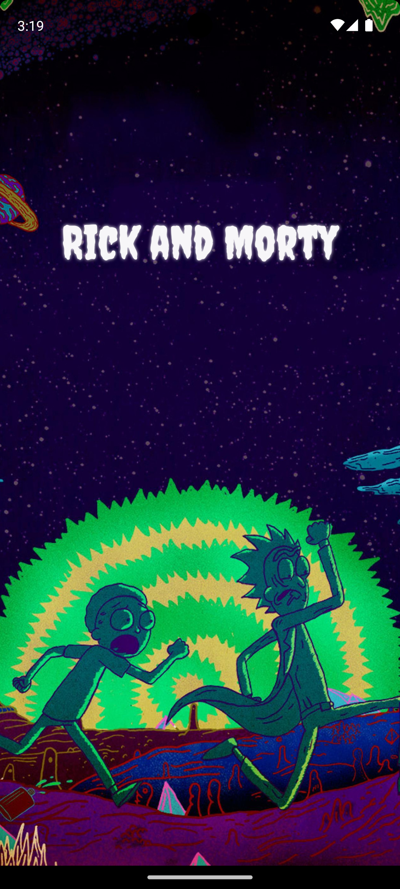
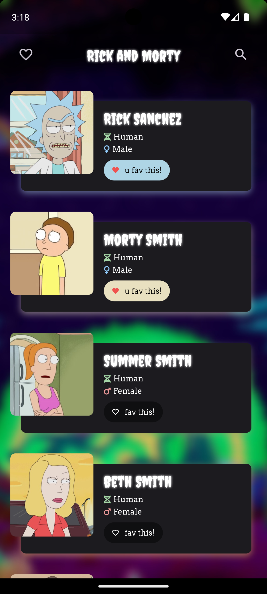
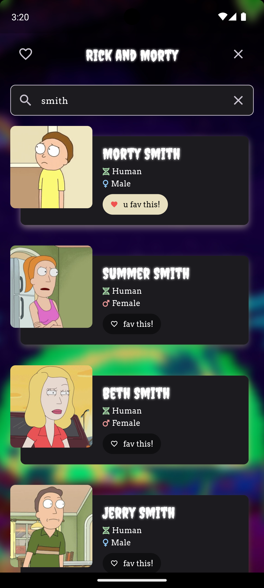
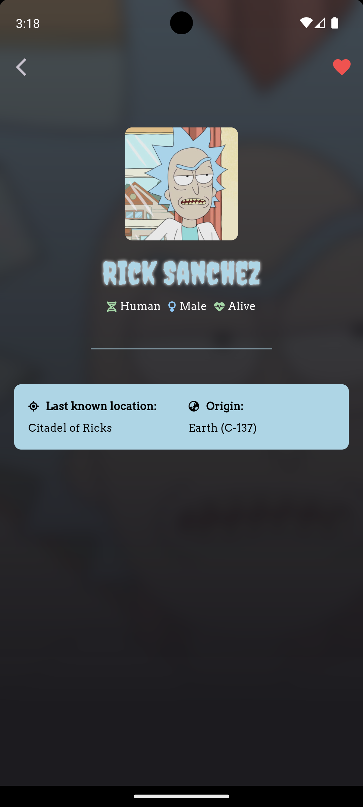

# Rick and Morty App

## Description
This is a simple app that uses the [Rick and Morty API](https://rickandmortyapi.com/) to display a list of characters and their details. Users can search for characters by name, add characters to their favorites, and view their favorites.

This app is built with Flutter and [Riverpod](https://riverpod.dev/) for state management, [Dio](https://pub.dev/packages/dio) for networking, and [Sqflite](https://pub.dev/packages/sqflite) for local storage.

## Table of Contents
- [Rick and Morty App](#rick-and-morty-app)
  - [Description](#description)
  - [Table of Contents](#table-of-contents)
  - [Features](#features)
  - [Libraries](#libraries)
  - [Project Structure](#project-structure)
  - [Screenshots](#screenshots)
  - [APK Link](#apk-link)

## Features
- [x] Display a list of characters
- [x] Display character details
- [x] Search for characters by name
- [x] Add characters to favorites
- [x] View favorites

## Libraries
- [Riverpod](https://riverpod.dev/) for state management
- [Dio](https://pub.dev/packages/dio) for networking
- [Sqflite](https://pub.dev/packages/sqflite) for local storage
- [Lottie](https://pub.dev/packages/lottie) for animations
- [Sliver Tools](https://pub.dev/packages/sliver_tools) for slivers
- [Animated Text Kit](https://pub.dev/packages/animated_text_kit) for animated text
- [Font Awesome Flutter](https://pub.dev/packages/font_awesome_flutter) for icons
- [Google Fonts](https://pub.dev/packages/google_fonts) for fonts
- [Cached Network Image](https://pub.dev/packages/cached_network_image) for cached images
- [Palette Generator](https://pub.dev/packages/palette_generator) for color extraction
- [Freezed](https://pub.dev/packages/freezed) for code generation
- [Json Serializable](https://pub.dev/packages/json_serializable) for code generation
- [Custom Lint](https://pub.dev/packages/custom_lint) for custom lints
- [Riverpod Lint](https://pub.dev/packages/riverpod_lint) for custom lints
- [Flutter Lints](https://pub.dev/packages/flutter_lints) for custom lints
- [Mockito](https://pub.dev/packages/mockito) for testing
- [Flutter Test](https://pub.dev/packages/flutter_test) for testing
- [Build Runner](https://pub.dev/packages/build_runner) for code generation
- [Riverpod Generator](https://pub.dev/packages/riverpod_generator) for code generation
- [Flutter Lints](https://pub.dev/packages/flutter_lints) for custom lints

## Project Structure
```
lib
├── common
├── data
│   ├── datasources
│   └── repositories
├── domain
│   ├── models
│   └── repositories
└── ui
    ├── pages
    │   ├── detail
    │   ├── favorites
    │   ├── home
    │   └── splash
    ├── providers
    │   ├── characters
    │   └── common
    ├── route
    ├── theme
    └── widgets
        └── character
```

- `common` - Contains common classes and functions used throughout the app.
- `data` - Contains classes that handle data operations.
  - `datasources` - Contains classes that handle data operations from external sources.
  - `repositories` - Contains classes that uses the data sources to provide data to the app.
- `domain` - Contains classes that represent the business logic of the app.
  - `models` - Contains classes that represent the data models of the app.
  - `repositories` - Contains classes the abstracts the data operations of the app.
- `ui` - Contains classes that represent the UI of the app.
  - `pages` - Contains classes that represent the pages of the app.
  - `providers` - Contains classes that provide data to the UI.
  - `route` - Contains classes that handle the routing of the app.
  - `theme` - Contains classes that represent the theme of the app.
  - `widgets` - Contains classes that represent the widgets of the app.

## Screenshots
|              Splash Screen               |             Home Screen              |              Search Screen               |              Detail Screen               |
| :--------------------------------------: | :----------------------------------: | :--------------------------------------: | :--------------------------------------: |
|  |  |  |  |


## APK Link
[Download APK](https://drive.google.com/drive/folders/1-azipIZpgVCxcqaDGDkP3AGDgwkWgJ5G?usp=sharing)
